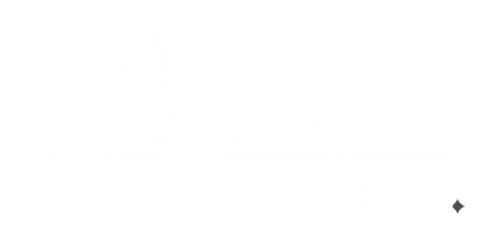

# Handoff — Login Redesign & Logo Rollout

**From:** Abstract Admin portal (`../abstract admin`, done)
**To:** Agency portal (`./`, to do)
**Date:** 2026-08-26

Two pieces of work, already shipped on the admin portal, to be repeated here:

1. **Login redesign** — strip the marketing splash down to a minimal, single-purpose sign-in.
2. **Logo rollout** — put the supplied `logo.png` in the login and in every sidebar, correctly aligned.

> Do **not** copy the admin HTML verbatim. This portal has its own type system and its own
> sidebar geometry — see [§5 Agency deltas](#5-agency-portal-deltas-read-before-you-start).

---

## 1. Why the login changed

| Removed | Reason |
| --- | --- |
| Portal selector (Admin / Client / Agency) | Each portal is on its **own subdomain** — there is no choice to make |
| SSO buttons (Google / Microsoft) | Not in scope; email + password only |
| "MFA Enabled" badge | Decorative — it advertised a state, it didn't do anything |
| Marketing panel (headline, feature list, stats, testimonial) | The user signing in already knows what the product is |
| Trust badges (SSL / SOC2), help links | Noise on an internal operator login |

**Kept:** email, password (with show/hide), keep-me-signed-in, forgot-password, one primary action.

The result is a centred card on the brand gradient. The rule of thumb: *an internal login is a
door, not a landing page.*

---

## 2. The logo asset

`logo.png` — already present in this repo (identical file to the admin's).

| Property | Value |
| --- | --- |
| Dimensions | 1758 × 872 |
| Format | PNG, RGBA, **genuinely transparent** (0% opaque dark pixels) |
| Artwork | White brush wordmark reading **"Abstract VMS"** (not "recruitment" — get the `alt` right) |
| Aspect ratio | 2.016 : 1 |
| Internal padding | **left 5.57%**, right 4.95%, top 7.45%, bottom 7.00% |

### The alignment trap (this is the whole point)

The PNG carries ~5.6% transparent padding on its left edge. Drop it into a left-aligned
container and the artwork floats visibly inward — it looks broken next to the label beneath it.
**Compensate with a negative left margin** equal to 5.57% of the rendered width:

| Height class | Rendered width | Left pad | Use |
| --- | --- | --- | --- |
| `h-8` (32px) | 64.5px | 3.6px | `-ml-[4px]` |
| `h-10` (40px) | 80.6px | 4.5px | `-ml-[4px]` |
| `h-12` (48px) | 96.8px | 5.4px | `-ml-[5px]` ← admin sidebar |
| `h-14` (56px) | 112.9px | 6.3px | `-ml-[6px]` |

**Centred placements need no compensation** (left/right padding differ by only 0.6%). So the
login logo gets no negative margin; sidebar logos do.

### Two traps already hit and solved

- **No `mix-blend-mode`.** An earlier asset had a baked black ground and needed
  `mix-blend-mode:screen`. This asset does not — and that hack is fragile (any ancestor
  creating a stacking context, e.g. a `z-10`, re-reveals the black box). Don't reintroduce it.
- **Tailwind CDN JIT only generates classes present in the HTML at load.** Arbitrary values like
  `-ml-[5px]` work fine in markup, but classes injected later via JS will silently not apply.

---

## 3. Reference implementation — login

Admin: `../abstract admin/abstract.identity-access.sign-in.html`. Structure to mirror:

```html
<body class="font-inter" style="background: linear-gradient(160deg, #0f1a3e 0%, #172554 35%, #1e1a4a 65%, #2d1a5e 100%);">
<main class="min-h-screen flex items-center justify-center px-4 py-10 relative overflow-hidden">

  <!-- soft brand glows -->
  <div class="absolute inset-0 pointer-events-none" aria-hidden="true">
    <div class="absolute -top-32 -left-32 w-96 h-96 rounded-full opacity-20" style="background: radial-gradient(circle, #1D4ED8 0%, transparent 70%);"></div>
    <div class="absolute -bottom-24 -right-24 w-96 h-96 rounded-full opacity-15" style="background: radial-gradient(circle, #5B2E91 0%, transparent 70%);"></div>
  </div>

  <div class="w-full max-w-[400px] relative z-10">

    <!-- logo: centred, so NO -ml compensation -->
    <div class="flex justify-center mb-6">
      
    </div>

    <!-- portal label -->
    <div class="flex flex-col items-center gap-2 mb-8">
      <span class="text-[11px] font-semibold uppercase tracking-[0.2em] text-white/50">Agency Portal</span>
    </div>

    <!-- white card: email / password / remember / submit -->
    <div class="bg-white border border-white/20 rounded-2xl shadow-2xl overflow-hidden">
      <div class="px-8 pt-8 pb-8"> … form … </div>
    </div>

    <p class="text-center text-xs text-white/40 mt-6">© 2026 Abstract Recruitment</p>
  </div>
</main>
```

Input and button treatment (admin tokens — **swap for agency equivalents, see §5**):

```html
<!-- input -->
class="w-full pl-11 pr-4 py-3 bg-slate-50 border border-slate-200 rounded-lg text-sm
       text-slate-800 placeholder-slate-400 focus:outline-none focus:bg-white
       focus:border-blue-400 focus:ring-4 focus:ring-blue-50 transition-all duration-200"

<!-- primary submit -->
style="background: linear-gradient(135deg, #1D4ED8, #5B2E91);"
```

---

## 4. Reference implementation — sidebar

The canonical block, now identical on all 22 admin screens:

```html
<div id="sidebar-logo" class="px-6 py-5 border-b border-white/10">
    
    <p class="text-white/40 text-xs mt-2">Admin Portal</p>
</div>
```

Logo stacked **above** the portal label, both flush left. Verified alignment on the admin:

| Element | Left edge |
| --- | --- |
| Logo artwork (after `-ml-[5px]`) | 24.4px |
| Portal label | 24.0px |
| Nav item icons | 25.0px |

---

## 5. Agency portal deltas (read before you start)

This portal is **not** a clone of the admin. Four differences that will bite:

### 5.1 Different type system
| | Admin | Agency |
| --- | --- | --- |
| Fonts | Inter (`font-inter`) | **Sora** (headings) + **Manrope** (body) |
| Tokens | nested `brand.blue`, `navy.700`, slate ramp | **flat**: `navy`, `blue`, `purple`, `lightbg`, `success`, `warning`, `danger` |
| Neutrals | `slate-*` | `gray-*` |

Brand hexes are the same (`#172554` / `#1D4ED8` / `#5B2E91`), so the **gradient is reused as-is**.
Everything else must be translated: `font-inter` → `font-manrope`, `text-slate-800` → `text-gray-800`,
`focus:ring-blue-50` → `focus:ring-blue`, etc.

### 5.2 The sidebar brand block is a fixed height
```html
<!-- current: 25 files -->
<aside id="sidebar" class="w-64 bg-navy text-white …">   <!-- flat navy, not a gradient -->
  <div class="h-16 flex items-center px-6 border-b border-white/10 flex-shrink-0">
    <div class="flex items-center gap-2">
      <div class="w-8 h-8 bg-blue rounded … ">A2</div>
      <span class="text-lg font-sora font-bold tracking-tight">Abstractvms 2</span>
    </div>
  </div>
```
That `h-16` (64px) is fixed. A stacked `h-12` logo + label needs ~112px and **will overflow**.
Pick one:

- **Option A (recommended, matches admin):** drop `h-16 flex items-center`, use `px-6 py-5`:
  ```html
  <div class="px-6 py-5 border-b border-white/10 flex-shrink-0">
      
      <p class="text-white/40 text-xs mt-2 font-manrope">Agency Portal</p>
  </div>
  ```
- **Option B (preserve the 64px header):** logo only, no label:
  ```html
  <div class="h-16 flex items-center px-6 border-b border-white/10 flex-shrink-0">
      
  </div>
  ```

### 5.3 The login is a split layout, not a card
`agency.identity-access.sign-in.html` is a 50/50 split (`.bg-login-split`, white left / navy
right) with a marketing headline and an SSO block. The redesign **replaces** that with the
centred card — delete the `.bg-login-split` CSS, the right-hand marketing column, and the SSO
section.

### 5.4 Different targets and counts
| | Admin | Agency |
| --- | --- | --- |
| Login file | `abstract.identity-access.sign-in.html` | `agency.identity-access.sign-in.html` |
| Sign-in redirects to | `2-…Admin Dash.html` | `agency.shell.dashboard.html` |
| Files with a sidebar | 22 | **25** |
| Portal label | "Admin Portal" | "Agency Portal" |
| Brand glyph to replace | gradient layer-group + "Abstract VMS" | blue `A2` chip + "Abstractvms 2" |

---

## 6. Execution plan

1. **Login** — rewrite `agency.identity-access.sign-in.html` per §3, translated per §5.1.
   Keep the redirect to `3-…Dashboard Over.html`. Label reads **Agency Portal**.
2. **Sidebars** — script the replacement across all 25 files; don't hand-edit.
   The admin used a div-matching script (safer than regex, since the block has nested divs):

```python
import re, pathlib
ROOT = pathlib.Path(".")
NEW = '''        <div id="sidebar-logo" class="px-6 py-5 border-b border-white/10 flex-shrink-0 flex justify-between items-center">
            
            <p class="text-white/40 text-xs mt-2 font-manrope">Agency Portal</p>
        </div>'''

def find_block(src, i):                      # match nested <div>…</div>
    i = src.index('>', i) + 1; depth = 1
    tag = re.compile(r'<(/?)div\b', re.I)
    while depth:
        m = tag.search(src, i)
        if not m: return None
        depth += -1 if m.group(1) else 1
        i = m.end()
    return src.index('>', i) + 1

for f in sorted(ROOT.glob("*.html")):
    s = f.read_text(encoding="utf-8")
    i = s.find('<div class="h-16 flex items-center px-6 border-b border-white/10')
    if i == -1: continue
    end = find_block(s, i)
    if end: f.write_text(s[:i] + NEW.lstrip() + s[end:], encoding="utf-8")
```

3. **Sanity-check** every file: `<div>` vs `</div>` counts must match.
4. **Verify alignment in a browser**, not by eye — serve the folder and measure:

```js
const img = document.querySelector('#sidebar-logo img');
const r = img.getBoundingClientRect();
console.log({
  artworkLeft: (r.left + r.width * 0.0557).toFixed(1),   // want ≈ 24
  labelLeft:  document.querySelector('#sidebar-logo p').getBoundingClientRect().left,
  navIconLeft: document.querySelector('#sidebar nav a i').getBoundingClientRect().left
});
```

> `file://` will not let canvas read the PNG (CORS). Serve it:
> `python3 -m http.server 8743` and open `http://127.0.0.1:8743/…`.

---

## 7. QA checklist

- [ ] Login: no portal selector, no SSO, no MFA badge, no marketing copy
- [ ] Login: logo centred, **no** `-ml` compensation, on the brand gradient
- [ ] Login: label reads "Agency Portal"; Sign in → `3-…Dashboard Over.html`
- [ ] Password show/hide toggles `type` **and** `aria-label`
- [ ] All 25 sidebars updated; artwork left edge ≈ label left edge (±1px)
- [ ] `alt="Abstract VMS"` everywhere (not "recruitment")
- [ ] No `mix-blend-mode` anywhere
- [ ] Typography is Sora/Manrope, neutrals are `gray-*`, tokens are the flat agency set
- [ ] `<div>` balance unchanged in every touched file
- [ ] Flow check passes (no dead links)

---

## 8. Note on the asset

`logo.png` is 280 KB at 1758×872 but renders ~97px wide. An SVG (or a ~400px-wide PNG) would be
lighter and sharper on HiDPI. Not blocking — the current file works.
